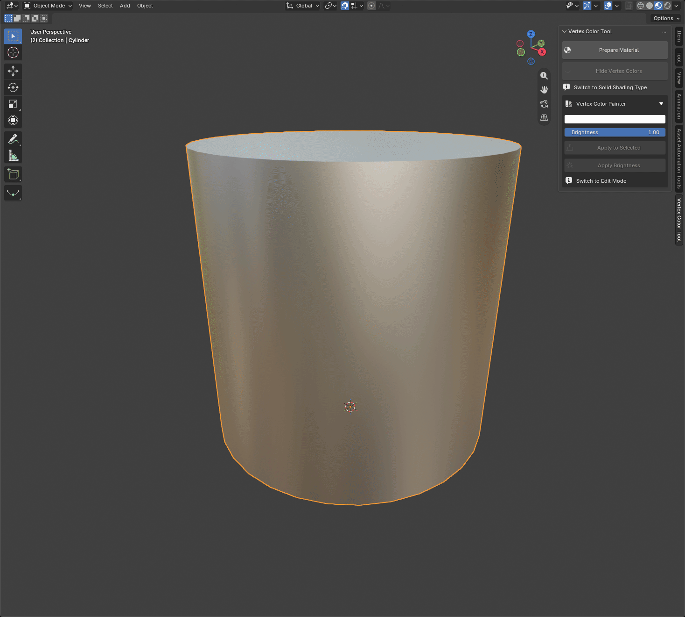

# Vertex Color Tool for Blender 5.2.0

A Blender addon for fast and intuitive vertex color painting.  
It allows you to prepare vertex color materials, apply colors to selected vertices, adjust brightness, and toggle viewport shading to display vertex colors.

**Author:** Pavel Círus

---

## Showcase

---

## Features

- **Prepare Material**
  - Creates a dedicated vertex color material
  - Adds a color attribute named `colorset1`
  - Automatically assigns the material to the active mesh

- **Paint Vertex Colors**
  - Choose a color and apply it to selected vertices in Edit Mode

- **Brightness Adjustment**
  - Adjust brightness based on the stored original vertex colors
  - Non-destructive until applied again

- **Viewport Toggle**
  - One-click toggle between Solid shading and Vertex Color visualization

- **UI Integration**
  - Located in **View3D → Sidebar → Vertex Color Tool**
  - Hotkey: **N**

---

## Installation

1. Download the latest `.zip` package.
2. In Blender, go to **Edit → Preferences → Add-ons**.
3. Click the **▼** menu in the top-right corner and select **Install from Disk...**
4. Select the downloaded `.zip` file.
5. Enable **Vertex Color Tool** in the Add-ons list.
